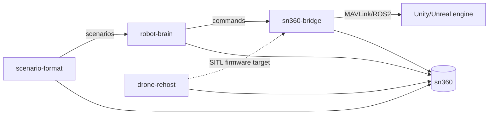

# BACKLOG — skytrack-oss (cross-project)

Cross-cutting roadmap. Per-project detail lives in each `*/docs/BACKLOG.md`.
Status legend: ✅ done · 🟡 in progress · ⬜ todo.

## Now (top priority)

- ⬜ **Make a brain fly PX4 SITL.** Wire real MAVLink transport into
  `sn360-bridge/common`, then bind it in `robot-brain`'s `DroneHAL`.
  (→ `sn360-bridge` M1–M2, `robot-brain` M1)
- ⬜ **CI smoke tests** on every push (run the four self-tests/demos + validate
  examples). (→ all projects)

## Next

- ⬜ `sn360-bridge`: UDP transport for the Unity/Unreal plugins; PX4 SITL
  round-trip demo (arm → takeoff → fly a square).
- ⬜ `scenario-format`: reference player that drives `sn360-bridge`; result/report
  schema for pass/fail.
- ⬜ `robot-brain`: local small-VLM perceiver + small-LLM planner reference path
  (the free tier).
- ⬜ `drone-rehost`: gdb/Unicorn MMIO hook wiring `rehost.py` into QEMU; bring a
  real flight image to its main loop.

## Later

- ⬜ "Migrating from AirSim" guide (`sn360-bridge`) — key for adoption.
- ⬜ Ground-robot (Vector) adapter in `robot-brain` and second firmware target in
  `drone-rehost` → the "same platform, two bodies" demo.
- ⬜ Integrate the chain end-to-end: `scenario-format` → `robot-brain` →
  `sn360-bridge` → engine, with `drone-rehost` as an optional SITL firmware target.
- ⬜ Per-project READMEs link their full `docs/` set (IDEA/ARCHITECTURE/FLOW/
  JOURNEY/STRATEGY/BACKLOG).

## Done

- ✅ Scaffolded four splittable OSS projects with the open-rim/closed-hub funnel.
- ✅ Built runnable code + self-tests for all four (verified).
- ✅ Added per-project doc sets (IDEA/ARCHITECTURE/FLOW/JOURNEY/STRATEGY/BACKLOG
  with Mermaid diagrams) and session-refresh docs (CLAUDE/CONTEXT/BACKLOG).

## Cross-project dependency

