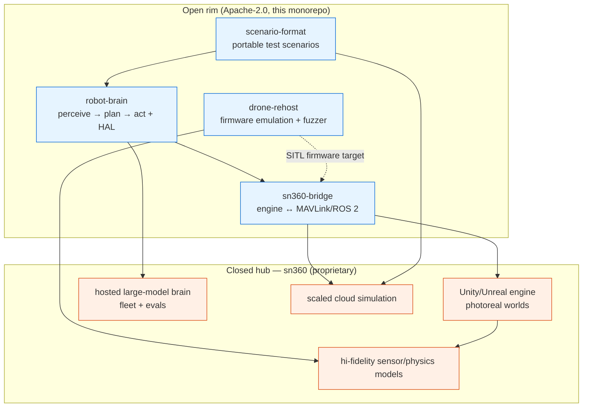
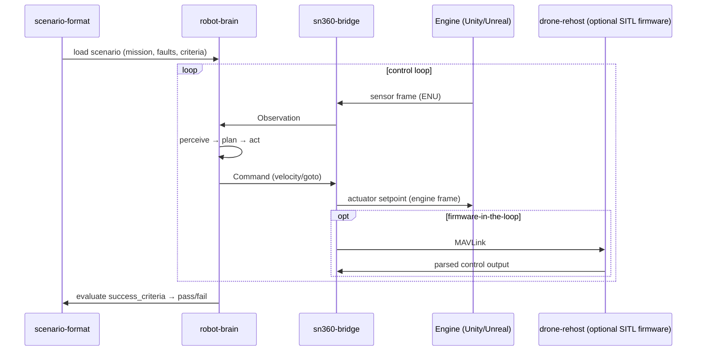
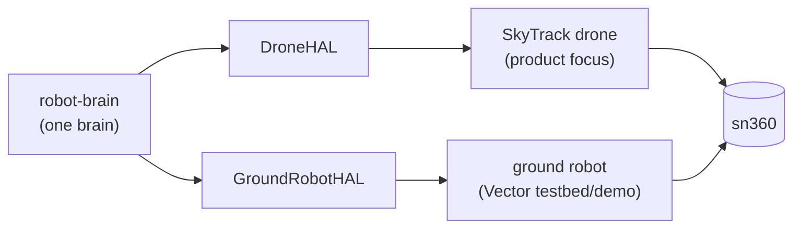

# Platform architecture — skytrack-oss × sn360

How the four open projects fit together and where the proprietary **sn360** hub
takes over. This is the bird's-eye view; each project's own
`docs/ARCHITECTURE.md` has the detail.

## The open rim and the closed hub

## End-to-end data flow (a scenario run)

## One platform, two bodies

The same brain, sim, and firmware toolchain serve both bodies. The drone is the
product; the ground robot is the cheap, safe testbed and the "look, it
generalizes" demo.

## Shared conventions

- **Canonical frame:** ENU meters; edges convert (MAVLink NED, Unity Y-up,
  Unreal Z-up/cm).
- **Transport:** MAVLink (pymavlink) and ROS 2 / DDS, centralized in
  `sn360-bridge/common`.
- **Funnel:** each project is useful alone; scale/fidelity/fleet → sn360.
