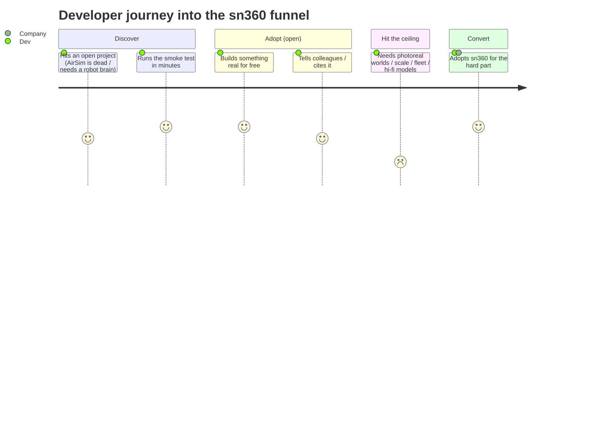
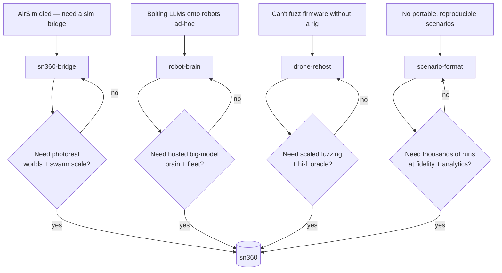

# Adoption journey — from open tools to sn360

How a developer travels from "I found one of these on GitHub" to an sn360
customer. The funnel is intentional: each open project solves a real problem
standalone, and each has a natural ceiling that sn360 lifts.

## The funnel

## Entry points → ceiling → sn360

## Why each ceiling is real (not artificial)

| Project | Free is genuinely useful for… | The wall you eventually hit |
|---------|------------------------------|------------------------------|
| `sn360-bridge` | connecting PX4/ROS 2 to a game engine | photoreal assets, swarm/cloud scale |
| `robot-brain` | portable autonomy, sim-to-real, local models | hosted large-model brain, fleet, evals |
| `drone-rehost` | rehosting + fuzzing on a laptop | continuous scaled fuzzing, hi-fi oracle, curated findings |
| `scenario-format` | authoring/sharing/validating scenarios | running thousands at fidelity + analytics |

## Cross-sell path

A developer who enters through one project meets the others (shared frame,
shared docs, the "same brain, two bodies" demo), widening the surface that leads
to sn360.
