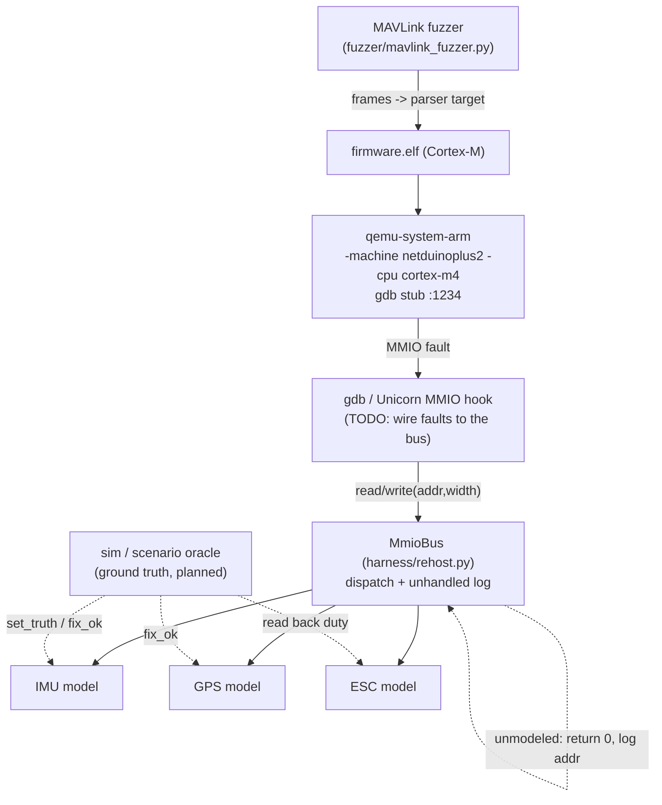
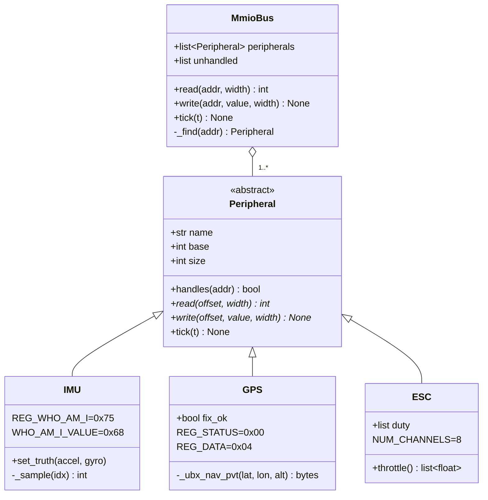

# ARCHITECTURE — drone-rehost

## Components

| Component | File(s) | Role |
|-----------|---------|------|
| **QEMU bring-up** | `harness/run_qemu.sh` | Boots Cortex-M `firmware.elf` in `qemu-system-arm` with a gdb stub. The MMIO hook that calls the bus is **TODO**. |
| **MmioBus** | `harness/rehost.py` | Engine-independent MMIO dispatcher. Routes each access to the owning peripheral; returns `0` and logs unmodeled accesses (P2IM style). |
| **Peripheral models** | `peripherals/*.py` | `IMU`, `GPS`, `ESC` standing in for real hardware over MMIO regions. |
| **Sim / scenario oracle** | *(planned)* | Feeds ground truth into sensor models (`IMU.set_truth`, `GPS.fix_ok`) and judges "interesting" behavior. Hooks exist; live wiring is TODO. |
| **MAVLink fuzzer** | `fuzzer/mavlink_fuzzer.py` | Mutates corpus seeds, feeds a target parser (`toy_parse` today; rehosted parser planned). |

The harness is **engine-independent**: `MmioBus` is exactly what a Unicorn/QEMU
hook invokes, and it is fully testable in pure Python without QEMU (see the
self-test in `harness/rehost.py`).

## Architecture diagram

## The Peripheral interface

Every model subclasses the `Peripheral` ABC (`peripherals/base.py`). A peripheral
owns the MMIO region `[base, base + size)`:

- `handles(addr) -> bool` — does this address fall in my region? (provided)
- `read(offset, width) -> int` — value firmware should see for a read. *(abstract)*
- `write(offset, value, width) -> None` — absorb a write (config, setpoints). *(abstract)*
- `tick(t) -> None` — advance internal state one step (optional, default no-op).

Note `read`/`write` receive a **region-relative `offset`** (`addr - base`); the bus
does the subtraction.

## MMIO dispatch

`MmioBus.read(addr, width)`:

1. `_find(addr)` scans `peripherals` for the first whose `handles(addr)` is true.
2. If found, call `p.read(addr - p.base, width)` and return the value.
3. If **not** found, append `("read", addr)` to `self.unhandled` and return `0`.

`write` mirrors this (records `("write", addr)` and no-ops when unmodeled).
`tick(t)` fans out to every peripheral.

## Unmodeled-access logging strategy (P2IM-style)

Unknown MMIO reads **return 0 and are logged**, never trap — so firmware keeps
making progress instead of spinning in a fault loop. The `unhandled` list is the
worklist: count the most-hit unmodeled addresses, and **promote** them into real
peripheral models until the main control loop runs. This is the iterative bring-up
loop described in [REHOSTING.md](./REHOSTING.md) and the P2IM paper.

## Modeled MMIO regions

Defaults from `default_peripherals()` (`peripherals/__init__.py`); all regions are
`0x100` bytes wide.

| Peripheral | Base | Size | Key registers (offset) | Behavior |
|-----------|------|------|------------------------|----------|
| **IMU** (MPU-6000-class) | `0x4000_4000` | `0x100` | `WHO_AM_I 0x75` -> `0x68`; `STATUS 0x3A` -> `0x01` (data ready); `ACCEL_XOUT_H 0x3B`+ -> 16-bit big-endian samples | Returns plausible id + synthetic accel/gyro (with dither); `set_truth()` injects sim ground truth; writes accepted/ignored. |
| **GPS** (UBX NAV-PVT) | `0x4000_5000` | `0x100` | `STATUS 0x00` -> `0x01` when `fix_ok`; `DATA 0x04` -> streamed UBX bytes | Streams a canned NAV-PVT frame; write to `STATUS` resets the stream cursor; `fix_ok=False` emulates GPS-denied. |
| **ESC** / PWM | `0x4000_6000` | `0x100` | `CH<n>_DUTY` at `4*n` (8 channels) | Latches per-channel duty on write; reads back commanded duty; `throttle()` maps 1000–2000us -> [0,1]. |

Unmodeled regions (anything not handled above) -> `0`, logged in `unhandled`.
