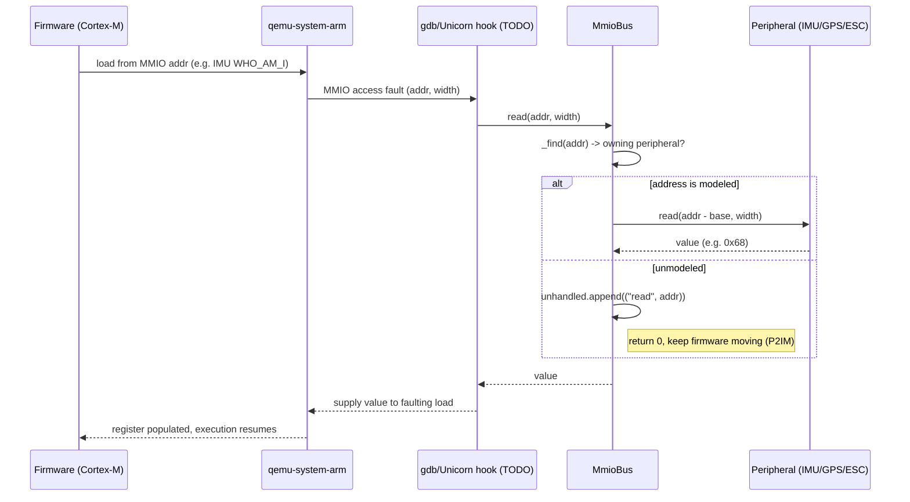
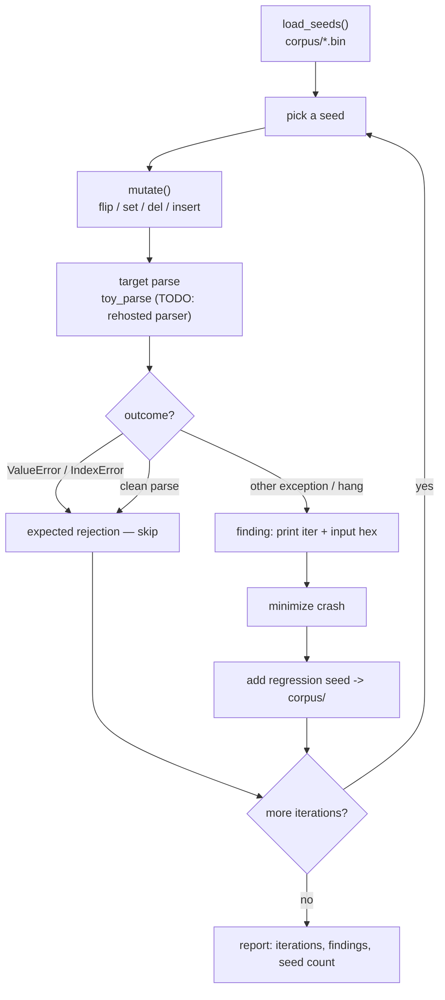

# FLOW — drone-rehost

Two flows: **rehosting** (boot firmware, service MMIO) and **fuzzing** (mutate
seeds, find crashes). Parts marked *(TODO)* are designed but not yet wired.

## Rehosting flow

1. Boot `firmware.elf` under `qemu-system-arm` (Cortex-M, gdb stub) via
   `harness/run_qemu.sh`.
2. A gdb/Unicorn MMIO hook *(TODO)* catches each MMIO fault and forwards it to
   `MmioBus.read/write` in `harness/rehost.py`.
3. `MmioBus` dispatches to the owning peripheral; **unmodeled** addresses return
   `0` and are logged in `unhandled` (P2IM style) so firmware keeps progressing.
4. Inspect `unhandled`, promote the hot addresses into real peripheral models, and
   repeat until the main control loop runs.

### MMIO read fault being serviced

You can exercise the bus end of this **without QEMU**: `python harness/rehost.py`
drives `MmioBus` directly (the self-test reads IMU `WHO_AM_I`, writes/reads an ESC
duty, and confirms an unmodeled address is logged not crashed).

## Fuzzing flow

1. `load_seeds()` reads `corpus/*.bin` (heartbeat, sys_status, param_request);
   falls back to a synthetic frame if the corpus is empty.
2. Each iteration: pick a seed, `mutate()` it (bit flip / byte set / delete / insert).
3. Feed the case to the target parser — `toy_parse` today (a deliberately fragile
   MAVLink v1 framer); a **rehosted firmware parser** *(planned)* for real targets.
4. Triage the result: expected rejections (`ValueError`/`IndexError`) are ignored;
   any other exception (or hang) is a **finding**, printed with the offending input hex.
5. Minimize a finding and add it back to `corpus/` as a regression seed.

Run it: `python fuzzer/mavlink_fuzzer.py -n 5000` (use `-s` to set the RNG seed for
reproducibility). With the toy target and the current corpus this reports 0
unexpected crashes — the framework is the deliverable; real findings come from
pointing it at a rehosted parser and scaling it (-> **sn360**).

## Oracle (planned)

A sim/scenario can close the loop on both flows: feed ground truth into sensor
models (`IMU.set_truth`, `GPS.fix_ok`, ESC duty read-back) and judge "interesting"
behavior beyond crash-only signals. The hooks exist; live wiring is a backlog item.
