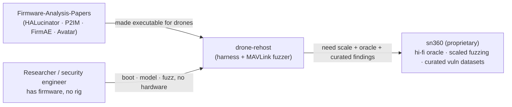

# IDEA — drone-rehost

## Vision

Make the firmware-analysis research **executable** for drones and small robots.
The academic literature on rehosting and firmware fuzzing is rich and mature, but
it stops at papers and per-target one-offs. `drone-rehost` packages that lineage
(HALucinator, P2IM, FirmAE, Avatar, para-rehosting, FIRM-AFL, IoTFuzzer) into a
concrete, runnable harness aimed squarely at **flight-controller firmware** — so a
researcher or security engineer can boot, analyze, and fuzz autopilot firmware
without a hardware rig, and feed it into simulation as a software-in-the-loop target.

## The painpoint

- The rehosting literature exists — but **nothing is packaged for the drone world**.
  PX4/ArduPilot-class firmware, MAVLink, IMU/GPS/ESC peripherals: no off-the-shelf
  emulation harness applies the research to this domain.
- Analyzing or fuzzing flight firmware usually means **owning hardware rigs** (real
  flight controllers, sensors, ESCs, bench setups). That gates who can do the work,
  how fast they iterate, and how safely (you cannot crash-loop a real airframe).
- Reproducing crashes and sharing findings is hard without a hardware-free,
  deterministic target.

## The value

- **Hardware-free bring-up:** boot firmware under QEMU; unmodeled MMIO returns 0 and
  is logged (P2IM style) so firmware keeps progressing instead of trapping. Promote
  hot unmodeled addresses into real peripheral models until the main loop runs.
- **Drone-aware peripheral models:** IMU (MPU-6000-class), GPS (UBX NAV-PVT with a
  GPS-denied toggle), ESC/PWM — enough to satisfy a flight stack's sensor/output threads.
- **A MAVLink fuzzer** with a seed corpus, ready to point at a rehosted parser.
- **Simulation as the oracle:** the sim/scenario can feed ground truth into sensor
  models and judge "interesting" behavior — a richer signal than crash-only fuzzing.
- **General toolchain:** a drone autopilot is the first target; a ground robot's
  firmware is a natural second target, proving the harness is not drone-specific.

## How it fits

## Funnel to sn360

`drone-rehost` is genuinely useful standalone, but its **scale mode** is sn360:
managed continuous fuzzing at fleet scale, a high-fidelity sensor/physics oracle,
and curated vulnerability datasets / reports. Every entry point here ends with a
clear "scale this up -> **sn360**" path.

## See also

- Parent research: [Firmware-Analysis-Papers](../../README.md)
- Monorepo strategy: [skytrack-oss](../README.md) · [OSS-STRATEGY](../OSS-STRATEGY.md)
- This project: [ARCHITECTURE](./ARCHITECTURE.md) · [STRATEGY](./STRATEGY.md)
