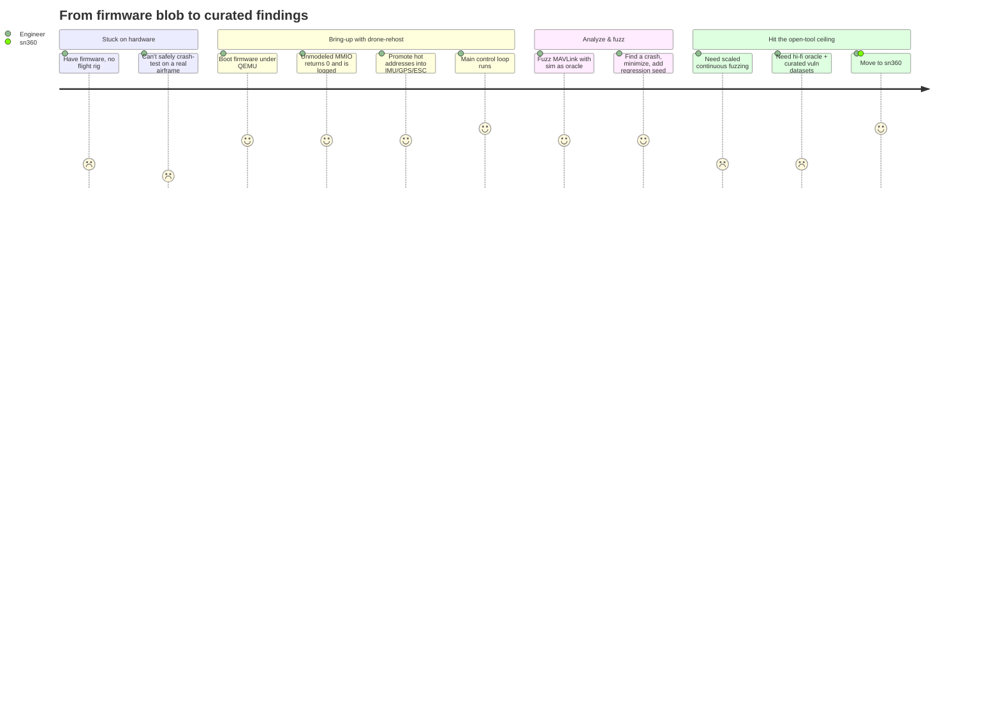
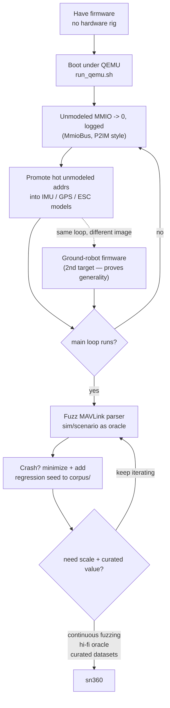

# JOURNEY — drone-rehost

The path a researcher or security engineer walks: from "I have firmware but no
hardware rig" to a running, fuzzable, sim-driven target — and where that hits the
ceiling of the open tools and crosses into **sn360**.

## The journey

## Step by step

## Notes

- **Iterative bring-up** is the core loop: the `unhandled` list from `MmioBus` is
  your worklist — model the addresses firmware actually touches, nothing more, until
  the control loop progresses.
- **The oracle upgrades fuzzing:** instead of crash-only signal, the sim/scenario
  feeds ground truth (`IMU.set_truth`, `GPS.fix_ok`) and judges behavior — catching
  logic faults a crash-only fuzzer misses. (Hooks present; live wiring is on the backlog.)
- **Second firmware target:** a ground robot (Anki Vector rebuild) reuses the *same*
  harness and bring-up loop with a different image. It is a second **target** that
  proves the toolchain is general — not a parallel product. The drone stays the focus.
- **Where it goes proprietary:** the open tools get you to a running, fuzzable target.
  Scaled continuous fuzzing, a high-fidelity sensor/physics oracle, and curated
  vulnerability datasets / reports live in **sn360** — the natural next step once the
  open harness has proven the target out.

See [STRATEGY](./STRATEGY.md) for the open-vs-sn360 split and [BACKLOG](./BACKLOG.md)
for the milestones that turn this journey from scaffold into reality.
