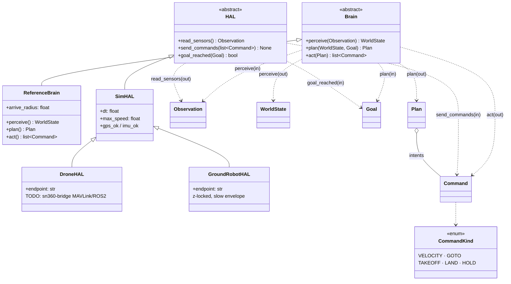
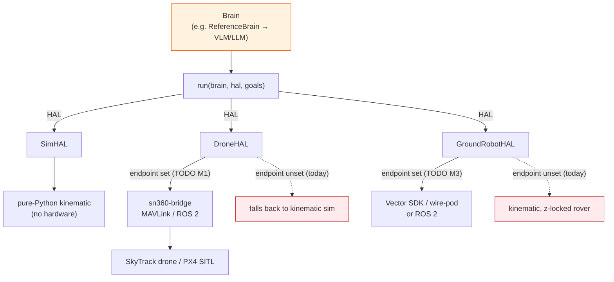

# ARCHITECTURE

Two abstractions, deliberately tiny. The **`Brain`** owns autonomy; the
**`HAL`** owns the body. A body-agnostic `run()` loop drives them.

## The two contracts

```python
class Brain(abc.ABC):                       # autonomy — body-agnostic
    def perceive(self, obs: Observation) -> WorldState: ...
    def plan(self, state: WorldState, goal: Goal) -> Plan: ...
    def act(self, plan: Plan) -> list[Command]: ...

class HAL(abc.ABC):                         # embodiment — one per body
    def read_sensors(self) -> Observation: ...
    def send_commands(self, commands: list[Command]) -> None: ...
    def goal_reached(self, goal: Goal) -> bool: ...
```

The invariant that makes everything portable: **the brain never references a
body, and the HAL never contains autonomy logic.** That single rule is why the
same brain flies a drone and drives a desk robot.

## The run loop

`core.run(brain, hal, goals)` (in `core/brain.py`) iterates each goal until the
HAL reports it reached, capped by `max_steps`:

```python
for goal in goals:
    while not hal.goal_reached(goal):
        obs   = hal.read_sensors()      # body → raw sensors
        state = brain.perceive(obs)     # raw → world-state estimate
        plan  = brain.plan(state, goal) # state + goal → intents
        hal.send_commands(brain.act(plan))  # intents → actuator commands → body
```

Returns `True` if every goal was reached within `max_steps`, else `False`.

## The type system

All types are frozen dataclasses in `core/types.py`, kept small and serializable
so the same brain works in sim, on a drone, or on a rover unchanged. Frame is
**ENU, meters, m/s, radians**; time is seconds since scenario start.

| Type | Role | Key fields |
|------|------|-----------|
| `Observation` | Raw sensor snapshot from a HAL | `t`, `position`, `velocity`, `attitude`, `gps_ok`, `imu_ok`, `extras` |
| `WorldState` | Brain's interpretation after perception | `t`, `position`, `velocity`, `heading`, `localization_ok`, `notes` |
| `Goal` | What the agent is trying to achieve | `kind`, `target`, `speed`, `deadline` |
| `Plan` | Planner output | `intents: list[Command]`, `rationale` |
| `Command` | One actuator-level command | `kind: CommandKind`, `value`, `speed` |
| `CommandKind` | Command enum | `VELOCITY`, `GOTO`, `TAKEOFF`, `LAND`, `HOLD` |
| `Vec3` | 3-tuple of floats | ENU x/y/z |

`extras` on `Observation` (camera frames, ToF, battery, ...) is the hook a richer
perceiver consumes. `localization_ok` / `notes` on `WorldState` is how a
perceiver flags degraded sensing (e.g. GPS dropout).

## Where intelligence plugs in

`ReferenceBrain` (`core/reference_brain.py`) is intentionally trivial:

- `perceive` does **dead-reckoning** — copies the observation into a `WorldState`
  and flags `localization_ok = gps_ok and imu_ok`.
- `plan` is a **proportional waypoint planner** — steers a velocity toward the
  target, eased in near arrival; handles `takeoff` / `land` / `hover` directly.
- `act` is a **pass-through** (the reference brain plans in actuator terms).

The upgrade path keeps the interface identical:

- Replace **`perceive`** with a **VLM** that turns `Observation.extras` (camera,
  depth) into a richer `WorldState`.
- Replace **`plan`** with an **LLM / VLA planner** that reasons over the state
  and goal to emit higher-level intents.
- Use **`act`** to lower abstract intents into concrete `Command`s.

That upgraded brain — hosted, large-model — is the **sn360 core**. The open repo
ships the contract plus a small local-model reference path (planned, M2).

## Class diagram



Note: `DroneHAL` and `GroundRobotHAL` **extend `SimHAL`** so they inherit the
kinematic integration math and add body-specific limits/transport. `DroneHAL`
currently still uses that inherited integration (TODO: real transport, M1).

## One brain over swappable HALs



The single brain on the left is unchanged across every body on the right; the
HAL is the only thing that varies.
