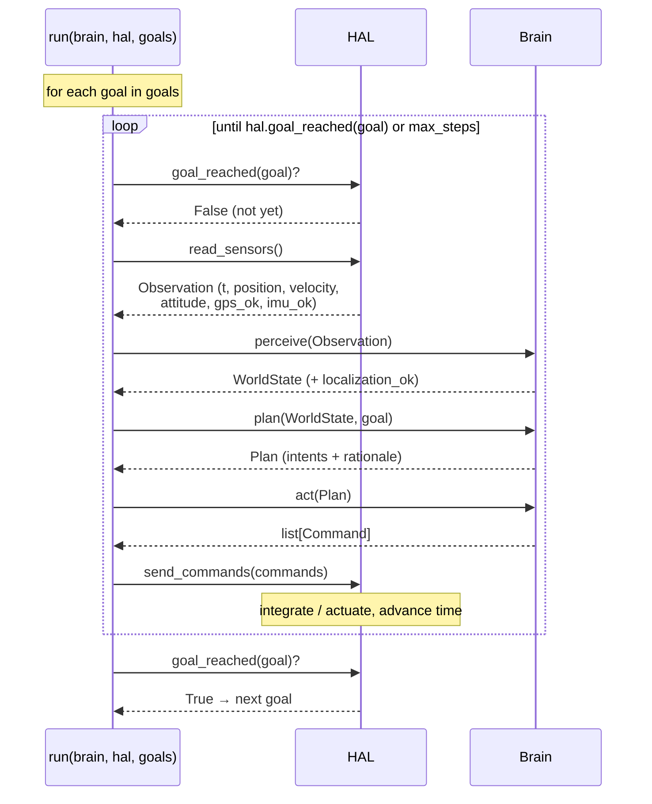
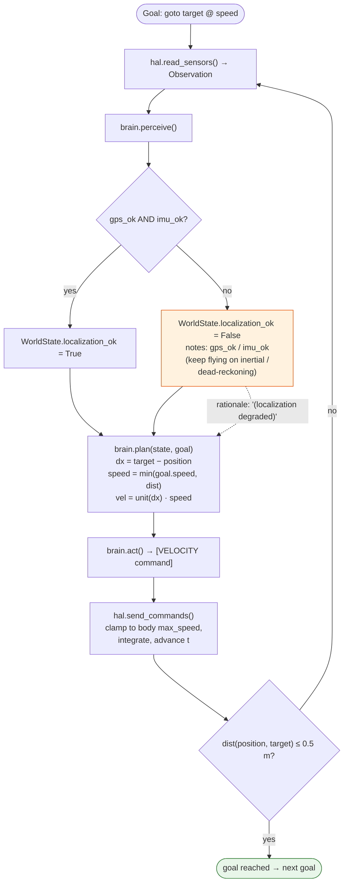

# FLOW — the perceive → plan → act control loop

The `run()` loop (`core/brain.py`) drives a list of goals to completion. For
each goal it spins a tight `perceive → plan → act` cycle until the HAL reports
the goal reached (or `max_steps` is hit).

## Control loop (one step)

When every goal reports reached within `max_steps`, `run()` returns `True`;
otherwise it returns `False`.

## How a `goto` goal resolves (with the degraded-localization branch)

`ReferenceBrain.plan` steers a proportional velocity toward the target, eased in
as it approaches. `perceive` sets `localization_ok = gps_ok and imu_ok`; when
GPS (or IMU) drops, the brain keeps flying on inertial/dead-reckoning and
annotates the plan rationale as **localization degraded** rather than stopping.
`SimHAL.goal_reached` declares arrival within 0.5 m of the target.

### Notes on the body-specific behavior in this flow

- **`SimHAL`** clamps the velocity vector to its `max_speed`, integrates with a
  fixed `dt`, and keeps `z ≥ 0`.
- **`DroneHAL`** uses a tighter envelope (`max_speed = 12.0`) and *today*
  inherits the kinematic integration — real MAVLink/ROS 2 transport via
  `sn360-bridge` is TODO (see [BACKLOG M1](./BACKLOG.md)).
- **`GroundRobotHAL`** flattens any `z` intent (no takeoff/altitude), pins
  `z = 0`, and uses a slow envelope (`max_speed = 1.5`) so the same brain can be
  iterated safely indoors.
- For a **`hover`** goal with a `deadline`, `goal_reached` returns true once
  `t ≥ deadline` rather than on a position test.
