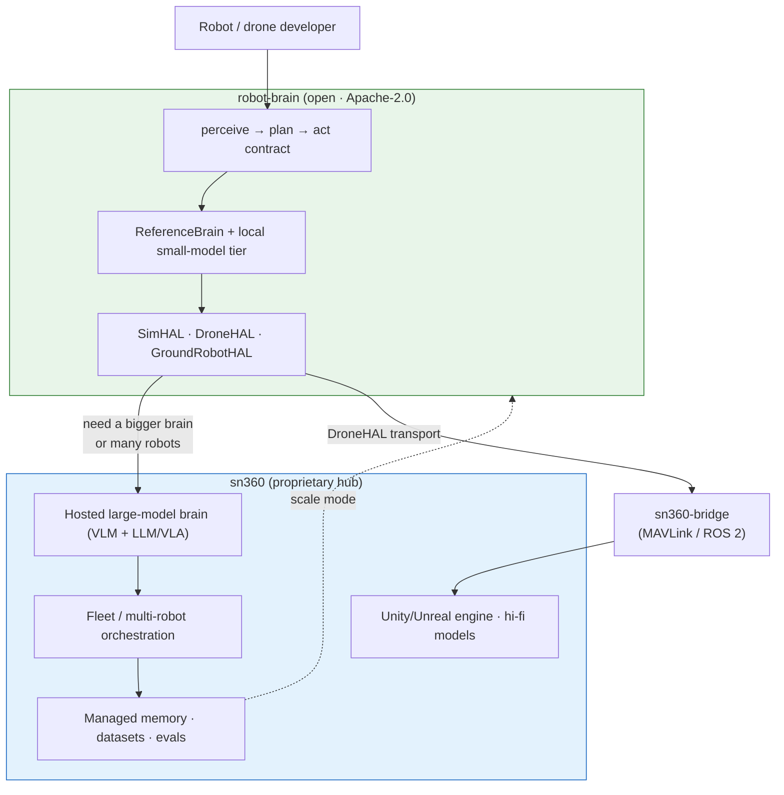

# IDEA — one brain, many bodies

## Vision

Write an autonomy stack **once** and run it on any body. A drone, a ground
robot, and a pure-software sim are the same problem — `perceive → plan → act` —
wearing different hardware. `robot-brain` makes that literal: the brain is a
single object with three methods, and the body is a swappable
hardware-abstraction layer (HAL). Swap the HAL, keep the brain.

## The painpoint

Embodied AI is exploding, but everyone is **bolting LLMs and vision-language-
action (VLA) models onto robots ad hoc**. Each integration is wired straight
into one robot's SDK, one message bus, one sim. The result:

- Autonomy logic is **not portable** — moving from sim to a drone to a rover
  means a rewrite each time.
- **Sim-to-real is painful** because the "sim brain" and the "real brain" are
  different code.
- There is **no small, stable contract** the community can standardize on, so
  every team reinvents the loop.

## The value

A tiny, stable contract — two abstractions, six methods — that decouples
**intelligence** from **embodiment**:

- **Portable autonomy:** the same `Brain` runs on `SimHAL`, `DroneHAL`, or
  `GroundRobotHAL` with zero changes (proven by
  `examples/one_brain_two_bodies.py`).
- **Pluggable intelligence:** `ReferenceBrain` is a trivial P-controller today;
  replace `perceive` with a VLM and `plan` with an LLM/VLA planner behind the
  exact same interface. The upgraded brain is the sn360 core.
- **Standard-shaped:** small enough to adopt, stable enough to build on.

## Sim-to-real

The HAL is the seam. `SimHAL` is pure Python and runs end-to-end in
milliseconds. `DroneHAL` and `GroundRobotHAL` extend that math and (will) swap in
real transport — MAVLink/ROS 2 via `sn360-bridge`, or a Vector SDK / wire-pod
for the rover. Because the brain never references a body, validating in sim and
deploying to hardware exercise **the same autonomy code**.

## Ground robot as testbed

You cannot crash-test drone autonomy 50× a day in the office. You can with a
small, slow, ground-locked robot (an Anki Vector–class rebuild). The
`GroundRobotHAL` clamps to the ground plane and a slow speed envelope so the
**same brain destined for the drone** can be iterated harmlessly and cheaply
indoors, then bound to `DroneHAL` once it is mature. The ground robot is a
**testbed and demo** that strengthens the drone roadmap — not a second product.

## The funnel to sn360

Open the rim, keep the hub. The interface, the reference brain, and a small
local-model tier are open and genuinely useful standalone. The high-value,
scale-mode pieces live in **sn360**:

The developer adopts the open interface, iterates on the free sim/rover tier,
and walks naturally toward sn360 when they need the hosted big-model brain or
fleet orchestration.
