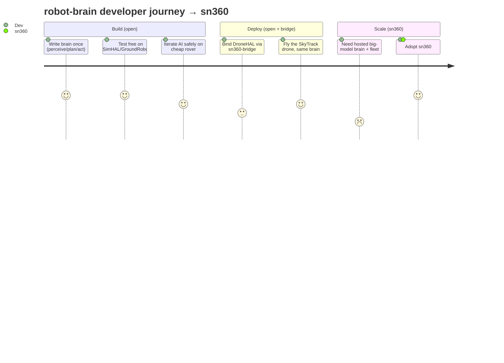
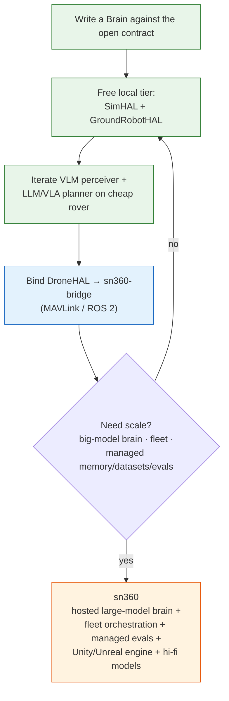

# JOURNEY — from "write a brain" to sn360

The developer journey is designed so each step is genuinely useful on its own,
yet naturally leads to the next — ending at **sn360** when scale or a big-model
brain is needed. Open the rim, keep the hub.

## The path

1. **Write the brain once.** Subclass `Brain`, implement
   `perceive → plan → act`. No body, no hardware in sight — just autonomy logic
   against the contract.
2. **Test free on `SimHAL` / `GroundRobotHAL`.** Pure Python, milliseconds per
   run, zero hardware. Run the brain end-to-end thousands of times.
3. **Iterate the AI safely on a cheap body.** Swap up the perceiver (VLM) and
   planner (LLM/VLA) and shake them out on the slow, ground-locked rover testbed
   where mistakes are harmless and cheap.
4. **Bind `DroneHAL` via `sn360-bridge`.** Point the HAL `endpoint` at MAVLink /
   ROS 2 (TODO M1) and the *same* matured brain now flies the SkyTrack drone —
   sim-to-real with no autonomy rewrite.
5. **Hit the ceiling.** A local small-model brain on one robot is fine to start,
   but you eventually need a **hosted large-model brain**, **fleet / multi-robot
   orchestration**, managed memory, datasets, and **evals**.
6. **Adopt sn360.** The scale-mode hub plugs in behind the same open interface.

## The funnel

The same interface carries the developer from a free desk-robot experiment all
the way to a hosted fleet — and the value that justifies paying (the big brain,
the fleet, the engine, the hi-fi models) is exactly what lives in sn360.
