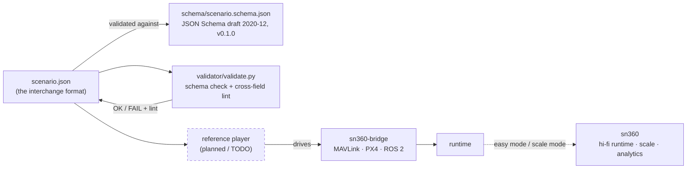
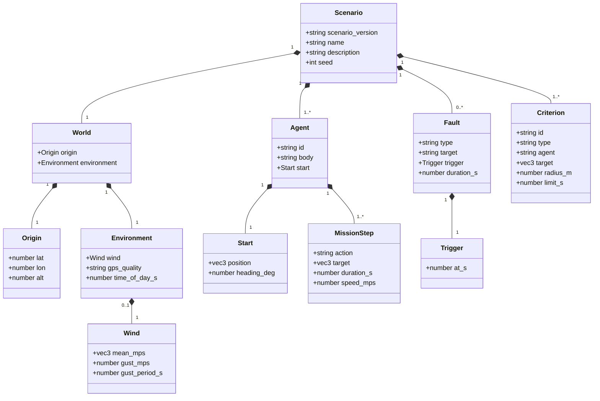

# ARCHITECTURE

`scenario-format` has three parts: the **format** (a JSON document), the
**schema + tooling** that validate and run it, and a **versioning model** that
lets the standard evolve. This doc describes the real v0.1.0 schema and notes
what is still planned.

## Components

- **Format** — a single, self-contained JSON file. Everything needed to replay
  is in it.
- **Schema** (`schema/scenario.schema.json`) — the source of truth; JSON Schema
  draft 2020-12, `$id` `https://sn360.dev/schemas/scenario/0.1.0/...`.
- **Validator** (`validator/validate.py`) — runs `Draft202012Validator` then a
  cross-field lint pass the schema can't express (faults/criteria referencing
  unknown agent ids). CLI: `python validator/validate.py examples/`.
- **Reference player** — *planned*. Will load a validated scenario and drive
  `sn360-bridge` to execute it, then evaluate `success_criteria`.
- **sn360-bridge** — the open connector (Unity/Unreal ↔ PX4 · MAVLink · ROS 2);
  the player's execution target.
- **sn360** — the proprietary runtime where the same format runs at high fidelity
  and cloud scale with analytics.

## Format structure

A scenario is built from independent, composable modules:

| Section | Required | Purpose |
|---------|----------|---------|
| `scenario_version` / `name` / `description` / `seed` | version, name required | Identity + deterministic replay |
| `world` | yes | `origin` (lat/lon/alt AMSL) + `environment` (wind, gps_quality, time_of_day) |
| `agents` | yes (≥1) | Each has `id`, `body`, `start`, and a `mission` (ordered steps) |
| `faults` | no | Injected failures with a `trigger.at_s` and optional `duration_s` |
| `success_criteria` | yes (≥1) | Conditions evaluated to decide pass/fail |

### Enumerated vocabularies (v0.1.0)

- **Bodies:** `multirotor`, `fixed_wing`, `ground_robot` — selects which
  actuator/HAL the runtime binds (see `robot-brain`).
- **Mission actions:** `takeoff`, `goto`, `hover`, `land`, `follow`,
  `return_home`. `goto`/`follow` use `speed_mps`; `hover` uses `duration_s`.
- **Faults:** `sensor_dropout` (targets a sensor name, e.g. `imu`), `gps_denied`,
  `wind_gust`, `motor_loss`, `comms_loss` (these four target an agent `id`).
- **Criteria:** `reach_waypoint`, `stay_within_geofence`, `land_within_radius`,
  `no_crash`, `max_mission_time`. Omitting `agent` on `no_crash` /
  `max_mission_time` applies it to all agents.

### Coordinate frame

`start.position`, `mission[].target`, and criterion `target` are `[x, y, z]`
(`vec3`) in **meters, local ENU** relative to `world.origin` (x=East, y=North,
z=Up).

## Object model

`Fault.target` and `Criterion.agent` are *soft references* to `Agent.id` — JSON
Schema can't enforce them, so the validator's lint pass checks them.

## Versioning model

The schema is **semantically versioned** and scenarios declare the version they
target via `scenario_version` (regex-pinned to `^0\.1\.[0-9]+$` in v0.1.0).

- **Patch (`0.1.x`)** — backward-compatible additions only (new optional fields,
  new enum members where tools degrade gracefully).
- **Minor (pre-1.0, `0.y`)** — breaking changes; scenarios must update their
  `scenario_version`.
- The schema `$id` embeds the version, so multiple schema versions can be
  published and resolved side by side.

See [BACKLOG.md](./BACKLOG.md) M5 for the planned governance/CI policy.
