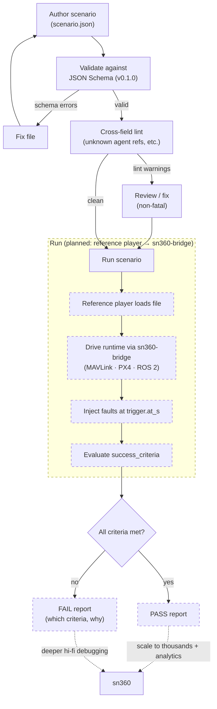
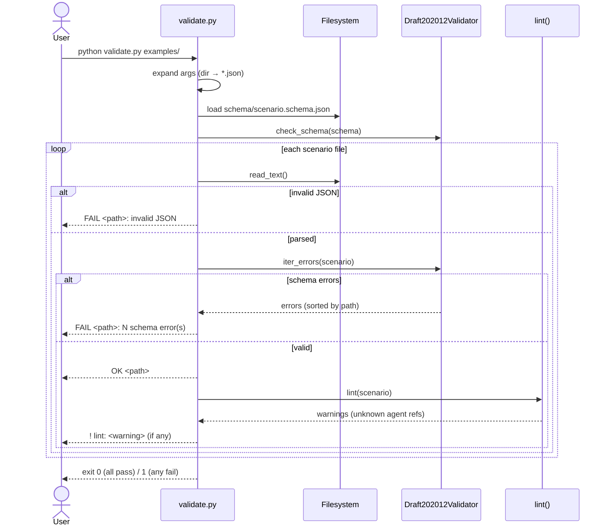

# FLOW — authoring & execution

How a scenario goes from a JSON file to a pass/fail result. The validate/lint
path is **built and working today**; the run/evaluate path uses the **planned**
reference player + `sn360-bridge`.

## End-to-end flow

### Stages

1. **Author** — write a single JSON document (world, agents+missions, faults,
   success_criteria). Deterministic via `seed`.
2. **Validate** — `python validator/validate.py <path>` runs the JSON Schema.
   Schema errors are fatal (exit `1`).
3. **Lint** — cross-field checks the schema can't express (e.g. a fault or
   criterion referencing an agent id that doesn't exist). Reported as non-fatal
   `! lint:` warnings.
4. **Run** *(planned)* — the reference player loads the validated file and drives
   `sn360-bridge`; faults fire at their `trigger.at_s`.
5. **Evaluate** *(planned)* — `success_criteria` are checked to produce a
   pass/fail report (report schema is also planned — see BACKLOG M3).
6. **Funnel** — running thousands at high fidelity with analytics → sn360.

## Validation sequence (built today)

The validator is intentionally simple and dependency-light: one schema check
(`jsonschema`) plus a small hand-written lint pass. It is the only piece that
must always stay green for the format to be trustworthy.
