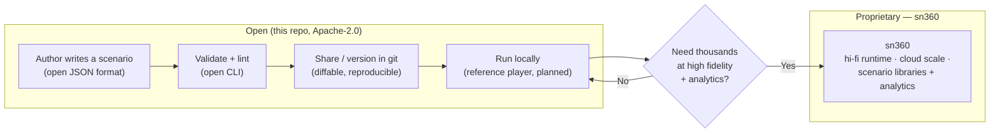

# IDEA — the OpenScenario for drones

## Vision

A single, open, versionable interchange format that fully describes a
reproducible drone/robot test — the world, the agents and their missions,
injected faults, and the criteria that decide pass/fail — in one JSON document.
Think **OpenSCENARIO / OpenDRIVE for the autonomous-vehicle world**, but for
drones and small robots: a portable standard any tool can read, write, diff, and
replay.

## The painpoint

There is **no portable, reproducible way to share drone test scenarios** across
tools today.

- Teams re-encode the same wind / sensor-failure / GPS-denied / mission setups
  by hand for every simulator they touch.
- "Run my test on your machine" means re-describing the scenario in prose, then
  hoping the re-encoding matches.
- Results are not reproducible: there is no single artifact that captures
  *everything needed to replay a run*, so a "pass" in one place can't be trusted
  elsewhere.
- Swarms, fault injection, and success criteria are exactly the parts everyone
  re-invents and gets subtly wrong.

## The value

One clean JSON-Schema standard makes scenarios:

- **Versioned** — `scenario_version` is semver; the schema evolves predictably.
- **Diffable** — plain JSON, so scenarios live in git and review like code.
- **Replayable** — a deterministic `seed` plus everything-in-the-file means the
  same scenario reproduces the same run.
- **Composable** — environment, faults, missions, and criteria are independent
  modules you mix and match.
- **Portable** — engine- and stack-agnostic; validated locally, run through
  `sn360-bridge`.

## How it funnels to sn360

The format is the *rim* — free, open, and the thing developers touch every day.
The *hub* — where scenarios actually run at fidelity and scale — is the
commercial product.

**Open:** the format + JSON Schema, the validator + reference player, and example
scenarios.
**sn360:** high-fidelity runtime & physics, scaled/cloud scenario execution, and
scenario libraries & analytics.

Owning the interchange standard means every scenario in the ecosystem already
speaks sn360's native language — adoption of the format is the on-ramp to the
runtime.
