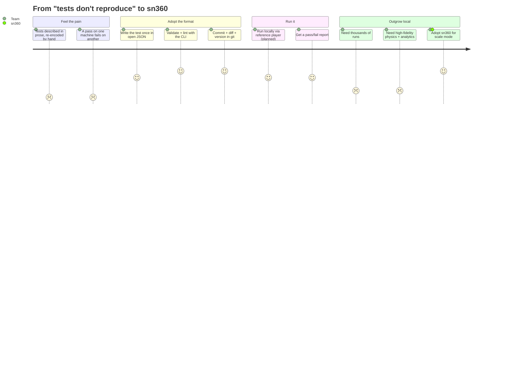
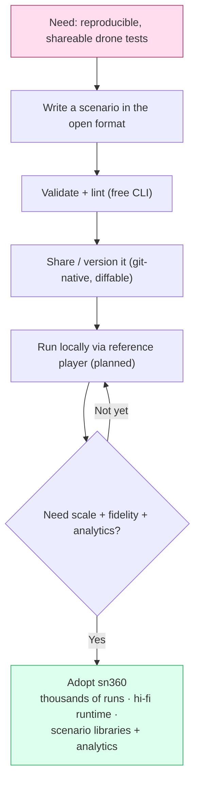

# JOURNEY — from reproducibility pain to sn360

The user journey for `scenario-format`: a team feels the pain of unreproducible
drone tests, adopts the open format to fix it, and grows into needing the
proprietary runtime for scale and fidelity.

## The journey

## The funnel

## Why each step earns the next

- **Write once, in the open format** — kills hand re-encoding; the file *is* the
  spec.
- **Validate + lint** — instant trust that the scenario is well-formed before
  anyone runs it.
- **Share / version** — plain JSON in git means review, diff, and provenance
  come for free; this is what makes results reproducible across teams.
- **Run locally** *(planned reference player)* — proves the format end-to-end at
  small scale, on free tooling.
- **Outgrow local → sn360** — when "run it once on my laptop" becomes "run ten
  thousand variations overnight at high fidelity and tell me what broke," the
  open tooling intentionally hands off to the proprietary runtime. The format
  the user already owns is sn360's native input, so the switch costs nothing in
  rework.

The format is deliberately useful on its own — adoption is the product. The
runtime is where scale and fidelity (and revenue) live.
