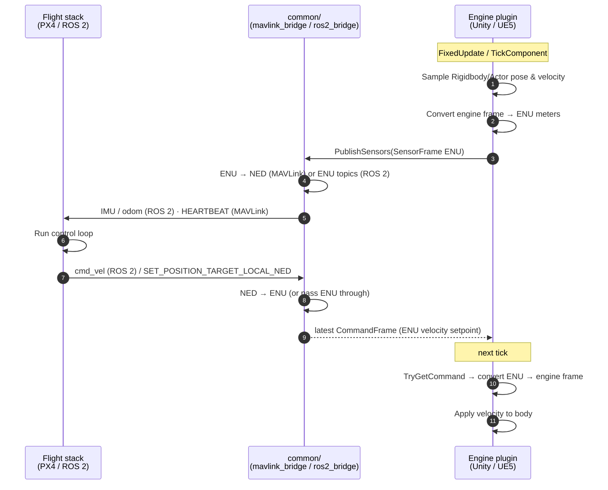
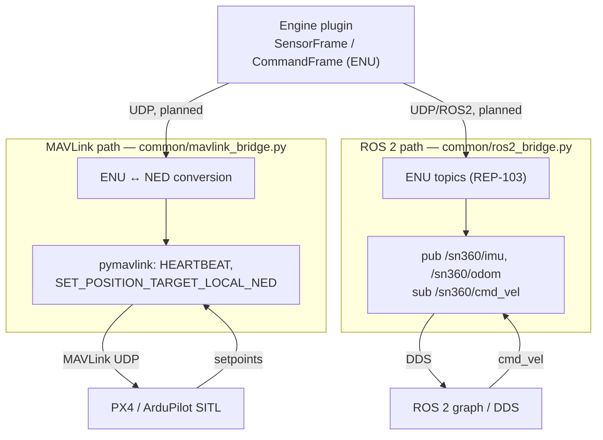

# FLOW — runtime & data flow in `sn360-bridge`

How a single simulation tick moves data between the flight stack, `common/`, and
the engine — and where frames get converted.

## The tick loop (sensor publish + command receive)

Each engine sim tick: the engine **publishes** its body's sensed state outward,
and **applies** the latest command setpoint coming back. The flight stack runs
its control loop on those sensors and emits velocity setpoints.



> **Current state:** `common/mavlink_bridge.py` sends HEARTBEAT + a fixed
> forward-velocity setpoint and (in dry-run) logs it; it does **not yet** ingest
> engine `SensorFrame`s. The engine side uses `LogTransport`, so the
> `EP ⇄ CM` arrows above are the **planned UDP path** (BACKLOG M1). The frame
> math at each edge is already in the code.

## MAVLink path vs ROS 2 path



- **MAVLink path:** talks to PX4/ArduPilot SITL directly. Setpoints are
  `SET_POSITION_TARGET_LOCAL_NED` in NED, so `common/` converts ENU↔NED.
- **ROS 2 path:** publishes/subscribes standard messages. ROS 2 already uses
  ENU/REP-103, so the conversion is mostly a pass-through; the work is message
  packing (`sensor_msgs/Imu`, `nav_msgs/Odometry`, `geometry_msgs/Twist`).

## Frame / unit conversion at each edge

```mermaid
flowchart LR
    subgraph CANON["Canonical: ENU meters (m/s, rad)"]
        C[("SensorFrame / CommandFrame")]
    end

    UNITY["Unity<br/>Y-up left-handed, m"]
    UNREAL["Unreal<br/>Z-up left-handed, cm"]
    NED["MAVLink NED, m"]
    ROS["ROS 2 ENU, m"]

    UNITY -->|px=p.x, py=p.z, pz=p.y| C
    C -->|vx, vz, vy → Unity| UNITY

    UNREAL -->|÷100 (cm→m), axis map| C
    C -->|×100, axis map → Unreal| UNREAL

    NED -->|N,E,D → E,N,U| C
    C -->|E,N,U → N,E,D| NED

    ROS <-->|REP-103: already ENU| C
```

Conversion rules, as in the code:

- **Unity** (`DroneSensorPublisher.cs`): `px=p.x, py=p.z, pz=p.y` (and same for
  velocity); attitude in radians. Inverse on the way back (`MotorSubscriber.cs`):
  `velocity = (cmd.vx, cmd.vz, cmd.vy)`.
- **Unreal** (`Sn360Bridge.cpp`): divide position/velocity by 100 (cm→m) into
  `FSn360SensorFrame.PositionENU/VelocityENU`.
- **MAVLink** (`mavlink_bridge.py`): canonical ENU ↔ NED conversion lives in
  `common/`; the wire uses `MAV_FRAME_LOCAL_NED`.
- **ROS 2** (`ros2_bridge.py`): ENU throughout (REP-103), no handedness flip.

## Related

[ARCHITECTURE](ARCHITECTURE.md) · [PROTOCOL](PROTOCOL.md) · [BACKLOG](BACKLOG.md)
