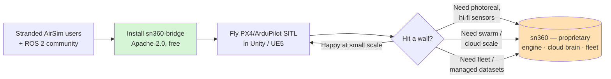

# IDEA — the vision behind `sn360-bridge`

## The painpoint

Microsoft **archived AirSim** in 2022. It was the de-facto way to fly real
autopilot code (PX4/ArduPilot) inside a game-engine world, and a large community
of drone-AI, reinforcement-learning, and computer-vision researchers and
startups built on it. They are now **stranded**:

- AirSim is unmaintained, pinned to old Unreal versions, and was never a
  first-class **ROS 2** citizen.
- There is **no maintained, modern Unity / Unreal Engine 5 + ROS 2** option for
  drone simulation.
- Forks are fragmented; none has clear momentum or a clean integration story.

That is a rare combination: **very high pain + a large, motivated, stranded
audience + no incumbent**.

## The idea

A clean, actively maintained **bridge** — not a whole simulator — that connects a
Unity or UE5 scene to real flight stacks:

- **Flight stacks:** PX4 / ArduPilot SITL via **MAVLink** (`pymavlink`).
- **Robotics middleware:** **ROS 2 / micro-ROS / DDS** (publish IMU/odometry,
  subscribe to velocity commands).
- **Engines:** Unity (C#) and Unreal Engine 5 (C++ component) with a matching
  sensor/actuator surface.

One canonical internal frame (**ENU meters**) keeps the core simple; conversions
happen at the edges. The bridge is small, permissive (Apache-2.0), and easy to
drop into an existing project — which is exactly what a stranded AirSim user
wants.

## Who it's for

- Drone-AI / RL / CV researchers who lost AirSim.
- Robotics teams standardizing on **ROS 2** who want a game-engine renderer.
- Startups prototyping autonomy who need SITL-in-the-loop visuals fast.
- Educators and hobbyists flying PX4/ArduPilot SITL in a pretty world.

## The value

- **For the community:** a maintained successor with a modern engine + ROS 2,
  permissively licensed, with runnable demos and a migration path from AirSim.
- **For us:** the bridge is the on-ramp. Everyone who simulates a drone installs
  it *before* they ever pay — and when they hit scale, fidelity, or fleet limits,
  the upgrade path is **sn360**.

## The funnel to sn360

"**Open the rim, keep the hub.**" The connector is open; the proprietary value
(photoreal environments, scaled cloud sim, hi-fidelity sensor/physics models,
cloud "robot brain", fleet management) stays in **sn360**.

The open bridge is genuinely useful on its own; sn360 is its **easy mode / scale
mode**.

## Related

[ARCHITECTURE](ARCHITECTURE.md) · [STRATEGY](STRATEGY.md) · [JOURNEY](JOURNEY.md)
