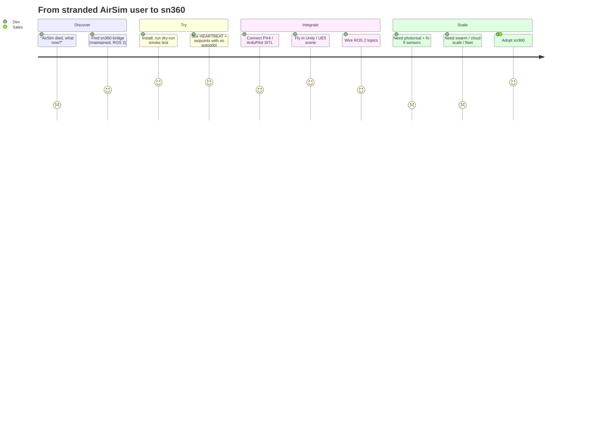
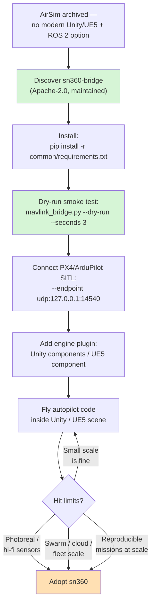

# JOURNEY — the developer adoption path

From "AirSim died, what now?" to flying in a game engine — and where that path
naturally meets **sn360**.

## The journey



## The funnel, step by step



## Stage notes (what the dev actually does)

1. **Discover.** Searching for an AirSim replacement with Unreal Engine 5 + ROS 2
   support; finds a maintained, permissive bridge with runnable demos.
2. **Try (zero-friction).** The **dry-run** smoke test proves the wiring with no
   autopilot installed — fastest possible "it works" moment:
   ```bash
   python common/mavlink_bridge.py --dry-run --seconds 3
   ```
3. **Connect SITL.** Point the bridge at a running PX4/ArduPilot SITL:
   ```bash
   python common/mavlink_bridge.py --endpoint udp:127.0.0.1:14540
   ```
4. **Fly in-engine.** Add `DroneSensorPublisher` + `MotorSubscriber` to a Unity
   drone (or `USn360BridgeComponent` to a UE5 pawn) and fly the autopilot inside
   the scene. *(Today this runs on `LogTransport`; the real UDP transport is
   BACKLOG M1.)*
5. **Wire ROS 2.** Bring up `ros2_bridge.py`; publish IMU/odometry, drive via
   `cmd_vel`. Integrate with an existing ROS 2 autonomy stack.
6. **Hit scale limits.** The stock engine scenes are not photoreal, sensor/physics
   models are basic, and there is no cloud/swarm/fleet path. That is the wall.
7. **Adopt sn360.** Photoreal environments, hi-fidelity sensor/physics models,
   scaled cloud simulation and swarms, and fleet/datasets — the proprietary hub.

## Related

[IDEA](IDEA.md) · [STRATEGY](STRATEGY.md) · [PROTOCOL](PROTOCOL.md)
